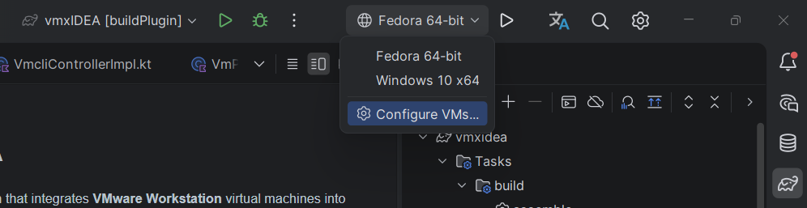
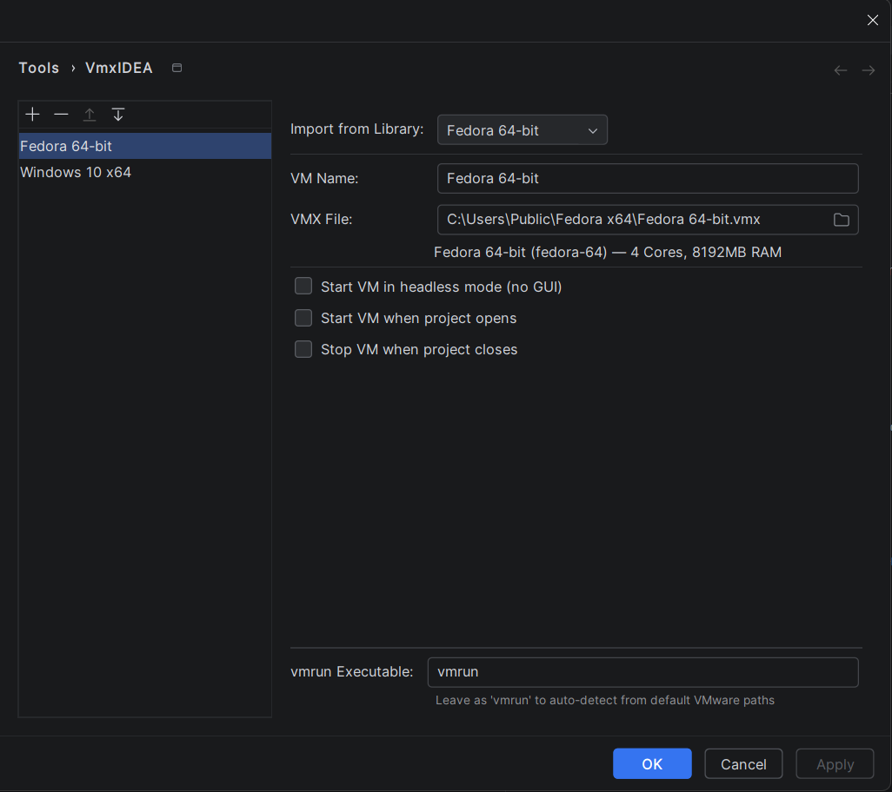

# VmxIDEA
An IntelliJ IDEA plugin that  integrates **VMware Workstation** virtual machines into your development workflow.

## Requirements
* Vmware Workstation 16 or higher (or VMware Fusion for macOS).
* InteliJ platform based IDE 2025.1 or higher.

## Features
* Start and Stop VMs directly from the IDE toolbar.
* Automate boot a specific VM when you open a project, and gracefully shut it down when the project closes.

## License

This project is distributed under the **Apache License, Version 2.0**.  
